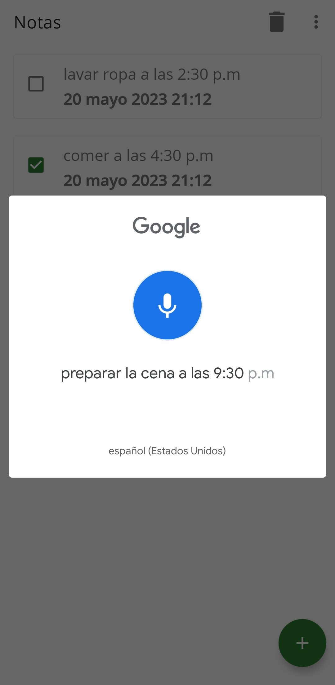
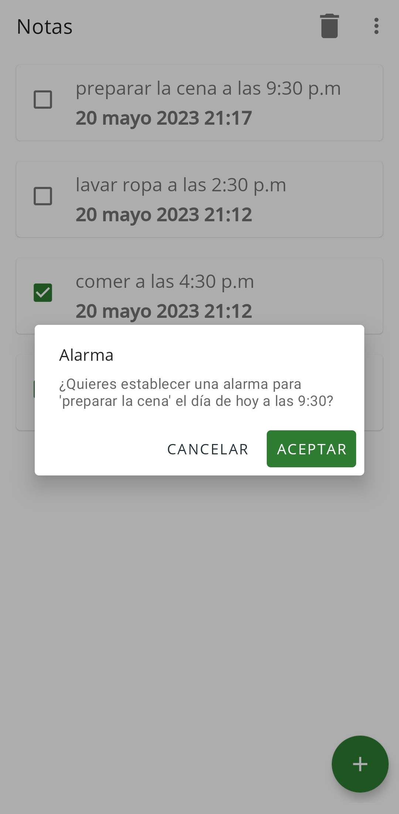
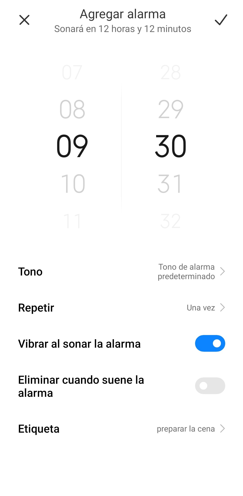
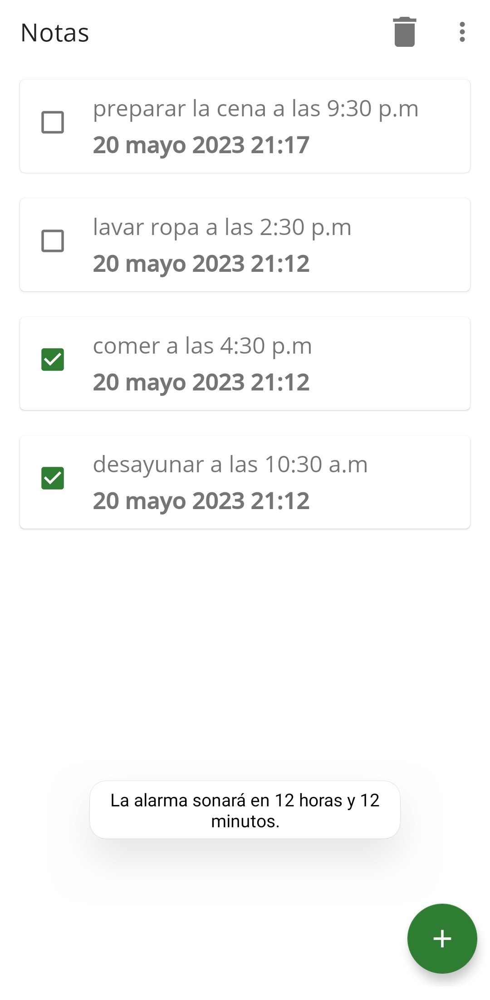
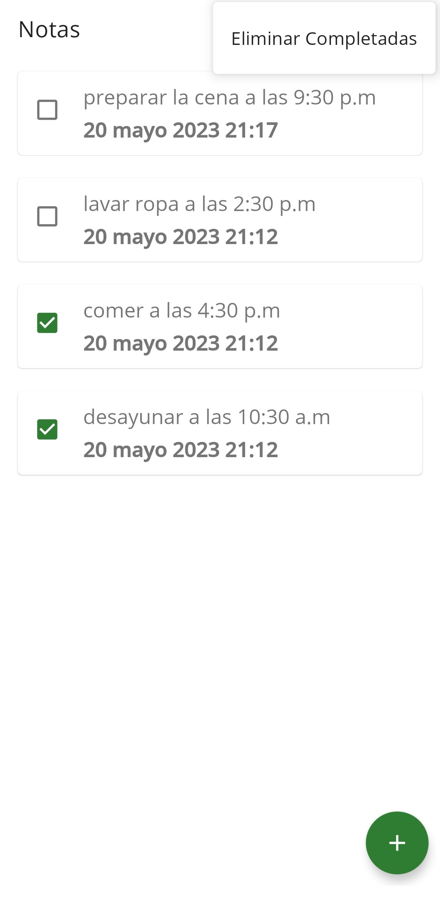
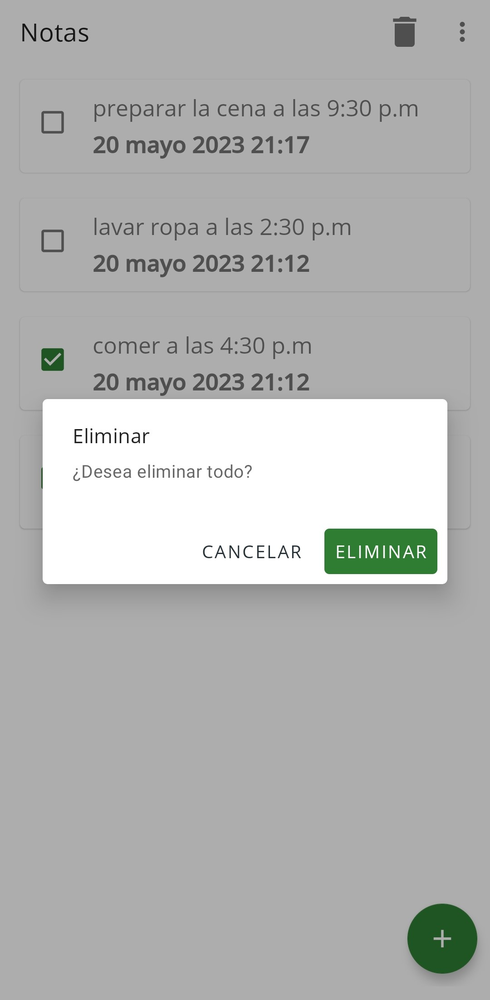

# MyNote Application

## Description


Android application programmed in Kotlin language that converts voice notes to text through Google Api Voice. If the note has a defined time, the user can set an alarm through the device's Alarm application. You can select the notes that you have completed successfully to remove them from your list. You can also delete all existing notes. The main libraries used are Room, Kotlin Coroutines and Dagger/Hilt.

## Features

* Convert voice note to note
* Schedule alarm through the device's Alarm application
* Show list of all notes including their status; complete and incomplete
* Select tasks that have completed
* Delete specific note On Swipe
* Delete only notes that have been completed
* Delete all notes

## Technologies

* Kotlin
* Dagger/Hilt
* Room
* Data Binding
* MVVM
* LiveData
* ViewModel
* Material Design
* Navigation Component
* Coroutines
* Google Voice

## Instalation

1. Clone this repository

```
    git clone https://github.com/lizarragabriel/MyNote.git
```

## Screens

### Take Note Screen

By pressing the add button, the user can convert a voice note to text. First choose an action followed by a specific time. If the text note does not find a specific time, it will only add the note to the list but there will be no option to set an alarm.

 Once the action and time have been established, an Alert Dialog will appear asking us if we want to set an alarm at the established time. Pressing 'Ok' will send us to the device's Alarm application where we can confirm the alarm.

<table>
    <tr>
        <td></td>
        <td></td>
        <td></td>
        <td></td>
    </tr>
</table>

### Delete Screen

You can select with a Check Box all the notes that you have concluded. If you want to delete these types of tasks, just press the menu and select the option delete completed tasks. If you want to delete all the notes from the list regardless of whether they have completed or not, just press the delete icon and hit the Ok button.

<table>
    <tr>   
        <td></td>
        <td></td>
    </tr>
</table>